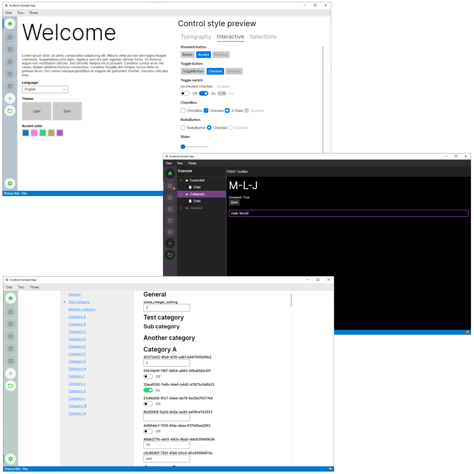

# Avalonia Sample App

[Avalonia](https://avaloniaui.net) is a great UI framework for cross-platform apps. Much like WPF, all the fundamental building blocks are there but developing a real application using proper architecture takes a bit more work.

You can use this example app as a base for getting started quickly and building your own projects on top of it. It demonstrates a modular design (_features_), light and dark themes with customizable _accent_ color, localization, and common application services such as _messaging_ and _dependency injection_. The overall architecture is intended to be very extensible.

**Please check out the more detailed [documentation](doc/README.md) on how to use these features.**

> 💡 **TIP:**  
If you are new to Avalonia, make sure you have the **Visual Studio extension** installed:
https://marketplace.visualstudio.com/items?itemName=AvaloniaTeam.AvaloniaVS

This solution uses the [MVVM Community Toolkit](https://learn.microsoft.com/en-us/dotnet/communitytoolkit/mvvm/) for _code generated_ properties and commands, but you may of course choose **Reactive UI** - or go completely without!

## Features

- **Modularity**. The application consists of _Features_ i.e. autonomous packages that contain views (and their view models) as well as service-like logic that other features may utilize. Features have overridable life-time methods for controlled wire-up and tear-down.
- **Themes**. Avalonia ships with _Dark_ and _Light_ "Fluent" themes that can be switched at runtime. Also the accent color used in control styles can be changed.
- **Localization**. Features may introduce their own _Resource Dictionaries_ that contain localizable strings. Changing the language can be done at runtime. Localized strings can be accessed both from AXAML and C# code. This app is partially translated into _Finnish_.
- **Published Views**. Features may introduce named _views_ that can be instantiated anywhere in AXAML (and by other features, too). Published views support parameters.
- **SVG Icons**. Vector icons are always crisp regardless of resolution or UI scaling. The app demonstrates how to dynamically colorize them, too.
- **Dependencies**. Features may implement _services_ via interfaces, and then other features or view models may have those instances automatically populated for them.
- **Common settings system**. Features and view models may utilize settings stored as key-value pairs. These settings are also saved on disk.
- **Common paths**. Features and view models may request commonly used paths for application data, temporary data, or user data.
- **Messaging**. Features and view models may communicate with each other via messages. The _Messenger_ uses the _Weak Event Pattern_ for subscriptions.

### The User Interface

- The **Shell** acts as the root feature and defines the main layout for other views.
- The **Navigation pane** (ViewSelector) on the left contains static Home, New, Open, and Settings items.
- The Navigation pane contains a **project list** that also serves as the "Recent Files" list. New projects can be added, and existing projects can be removed (via the context menu).
- **Home** screen (the default view) showcases how theming options and the language setting updates the UI.
- **Menu** and **StatusBar** only have some dummy content and are there just for the looks (well, they also demonstrate localization).
- **AppSettings** contains UI for settings. Features may publish their settings to this centralized view.
- **Project view** contains some dummy data and shows how to mark projects as "Dirty".

## Building and running

The solution uses:
- .NET 7
- Avalonia 11.0.0 preview 8

No special setup is needed. Open in **Visual Studio** and just **Build** & **Run** (assuming you have the .NET 7.0 SDK installed).

## License and acknowledgements

This software is released under the [MIT license](https://opensource.org/license/mit).

SVG Rendering enabled by [wieslawsoltes/Svg.Skia](https://github.com/wieslawsoltes/Svg.Skia).

MessageBox enabled by [AvaloniaCommunity/MessageBox.Avalonia](https://github.com/AvaloniaCommunity/MessageBox.Avalonia).

The SVG icons are from [Google's material symbols library](https://fonts.google.com/icons).